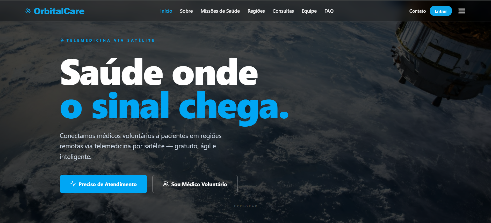
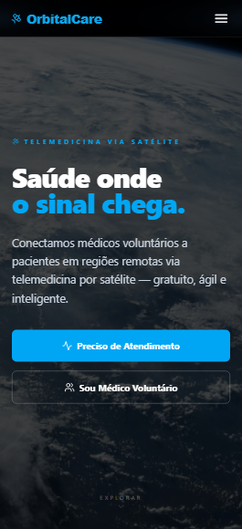

# 🛰️ Estelar — Saúde Acessível Onde o Sinal Chega


---

## 📡 Título e Descrição

**Estelar** é uma plataforma de telemedicina via satélite desenvolvida como solução para a **Global Solution 2026/1 da FIAP**, com o tema *Economia Espacial*. A proposta conecta médicos voluntários a pacientes em regiões remotas e isoladas do Brasil, utilizando conectividade via satélite como infraestrutura base.

Mais de 33 milhões de brasileiros vivem em municípios com menos de um médico por mil habitantes. O Estelar nasce para eliminar essa barreira geográfica, oferecendo triagem inteligente por urgência clínica e teleconsultas acessíveis, gratuitas e integradas com IA.

A aplicação foi desenvolvida em **React + Vite + TypeScript** com integração à API REST Java (Quarkus) hospedada no Azure e banco de dados Oracle.

---

## 🧩 Arquitetura da Plataforma (tudo integrado)

O Estelar é composto por **quatro serviços** que conversam entre si. O frontend é o ponto central e consome três back-ends via `fetch`:

```
┌─────────────────────────────────────────────┐
│            Frontend (Estelar)               │
│         React + Vite · Vercel               │
└───┬───────────────┬───────────────┬─────────┘
    │ fetch         │ fetch         │ fetch
    ▼               ▼               ▼
┌─────────┐   ┌─────────────┐   ┌──────────────┐
│ Java    │   │ 🩺 Risco    │   │ 🧠 IA        │
│ Quarkus │   │ Flask       │   │ Flask+sklearn│
│ Azure   │   │ Render      │   │ Render       │
│ login,  │   │ Calculadora │   │ Triagem      │
│ tickets │   │ de Risco    │   │ Inteligente  │
└─────────┘   └─────────────┘   └──────────────┘
```

| Serviço | Tecnologia | Hospedagem | O que faz no site |
|---|---|---|---|
| **Frontend** | React + Vite + TS | Vercel | Toda a interface |
| **Backend** | Java + Quarkus + Oracle | Azure | Login, pacientes, médicos, tickets |
| **API de Risco** | Python + Flask | Render | Página **Calculadora de Risco** |
| **API de IA** | Python + Flask + scikit-learn | Render | Página **Triagem IA** |

As URLs de cada API são configuráveis por variáveis de ambiente (`VITE_API_URL`, `VITE_RISCO_API_URL`, `VITE_IA_API_URL`) — veja [`src/config.ts`](src/config.ts).

---

## 🔗 Como Usar (Links do Projeto)

| Recurso | Link |
|---|---|
| 🌐 **Aplicação online (Vercel)** | https://global-solution2026.vercel.app/ |
| 💻 **Repositório GitHub (Front-End)** | https://github.com/gcorrea4/GlobalSolution2026 |
| 🎥 **Vídeo de apresentação (YouTube)** | https://youtu.be/iEcwR9XBZ88 |
| ⚙️ **API Java (Azure)** | https://app-orbitalcare-api.azurewebsites.net |
| 📋 **Swagger UI** | https://app-orbitalcare-api.azurewebsites.net/q/swagger-ui |
| 🩺 **API de Risco (Python · Render)** | repositório `estelar-risco-api` |
| 🧠 **API de IA (Python · Render)** | repositório `estelar-ia-api` |

---

## 🔑 Credenciais de Acesso para Avaliação

| Perfil | E-mail | Senha |
|---|---|---|
| 👑 **Administrador** | admin@orbitalcare.com | 123456 |
| 👨‍⚕️ **Médico** | carlos@orbitalcare.com | 123456 |
| 👤 **Paciente** | maria@email.com | 123456 |

> Outros médicos disponíveis: `ana@orbitalcare.com` e `joao@orbitalcare.com` (senha: 123456)
> Outros pacientes: `jose@email.com`, `analima@email.com`, `pedro@email.com`, `lucia@email.com` (senha: 123456)

---

## 🖥️ Executar localmente

**Pré-requisito:** [Node.js](https://nodejs.org/) 18+ instalado.

```bash
# 1. Clone o repositório
git clone https://github.com/gcorrea4/GlobalSolution2026.git
cd GlobalSolution2026

# 2. Instale as dependências
npm install

# 3. (Opcional) Configure a URL da API para desenvolvimento local
# Crie um arquivo .env.local na raiz com:
# VITE_API_URL=http://localhost:8080
# Sem esse arquivo, a aplicação aponta para a API em produção (Azure).

# 4. Inicie o servidor de desenvolvimento
npm run dev

# 5. Abra http://localhost:5173/ no navegador
```

### Scripts disponíveis

```bash
npm run dev         # servidor de desenvolvimento (Vite)
npm run build       # build de produção (tsc + vite build)
npm run preview     # preview do build local
npm run lint        # ESLint
npm run typecheck   # checagem de tipos sem emitir
npm run test        # testes unitários (Vitest)
npm run check       # tsc + eslint + vitest (pipeline completa)
```

---

## 🛠️ Tecnologias Utilizadas

| Categoria | Tecnologia |
|---|---|
| **Framework** | React 19 + Vite 8 |
| **Linguagem** | TypeScript 5.9 (tipagem estática rigorosa) |
| **Estilização** | Tailwind CSS 4 (sem CSS externo) |
| **Roteamento** | React Router DOM 7 (SPA com rotas estáticas e dinâmicas) |
| **Ícones** | Lucide React |
| **Mapas** | Leaflet + React-Leaflet + Leaflet.Heat |
| **Animações** | Framer Motion 12 |
| **Geração de PDF/CSV** | jsPDF + jsPDF-AutoTable |
| **Integração com API** | Fetch API nativa (sem Axios) |
| **Testes** | Vitest + Testing Library |
| **Linting** | ESLint 9 + typescript-eslint |
| **Deploy Front-End** | Vercel |
| **Deploy Back-End** | Azure App Service (container Docker) |
| **Banco de Dados** | Oracle (FIAP) — schema T_OC_ |
| **Versionamento** | Git + GitHub |

---

## ✨ Funcionalidades Implementadas

- 🔐 **Autenticação por perfil** — admin, médico e paciente, com `ProtectedRoute` validando sessão e role antes de renderizar cada dashboard.
- 📋 **Cadastro de pacientes** com seleção de especialidade necessária, descrição de sintomas e nível de urgência.
- 🏥 **Triagem inteligente** — algoritmo que prioriza pacientes por urgência clínica e especialidade necessária.
- 🩺 **Calculadora de Risco Clínico** (`/calculadora-risco`) — integra a API Python **AstraCare**; recebe sinais vitais, sintomas e contexto e retorna o nível de risco (EMERGÊNCIA/URGENTE/ATENÇÃO/BAIXO) com conduta recomendada.
- 🧠 **Triagem com IA** (`/triagem-ia`) — integra a API Python **OrbitalCare IA**; usa modelos de Machine Learning (scikit-learn) para classificar urgência e estimar tempo de espera.
- 🗺️ **Mapa interativo (Leaflet)** com heatmap de pacientes por região e cobertura satelital.
- 📊 **Dashboard Admin** com métricas operacionais, listagem de médicos e pacientes, exportação de relatórios em PDF e CSV.
- 👨‍⚕️ **Dashboard Médico** — fila priorizada, aceitação de pacientes, teleconsultas e prontuário.
- 👤 **Dashboard Paciente** — acompanhamento de status, histórico de consultas e prontuário individual.
- 📁 **Prontuário dinâmico** via rota com parâmetro (`/prontuario/:nome`).
- 🌙 **Dark mode** com hook `useDarkMode` — tema escuro por padrão.
- 📱 **Layout 100% responsivo** — Mobile (até 480px), Tablet (768px) e Desktop (992px+).
- 🛰️ **Página de Regiões** — mapa de cobertura satelital e regiões remotas atendidas.
- 📅 **Página de Consultas** — agendamento e gestão de teleconsultas.

---

## 📁 Estrutura de Pastas do Projeto

```text
GlobalSolution2026/
├── public/                         # Assets estáticos
├── src/
│   ├── components/                 # Componentes reutilizáveis
│   │   ├── ui/                     # Design system (Button, Card, Input, Badge, etc.)
│   │   ├── Header.tsx              # Cabeçalho com navegação e dark mode
│   │   ├── Footer.tsx              # Rodapé
│   │   ├── ProtectedRoute.tsx      # Guard de rotas autenticadas
│   │   ├── ModalAvaliarPaciente.tsx
│   │   ├── ModalFichaAtiva.tsx
│   │   └── StatusAgendamento.tsx
│   ├── pages/                      # Views (uma por rota)
│   │   ├── Home.tsx                # Página inicial
│   │   ├── Sobre.tsx               # Sobre o projeto
│   │   ├── Integrantes.tsx         # Página da equipe
│   │   ├── FAQ.tsx                 # Perguntas frequentes
│   │   ├── Contato.tsx             # Formulário de contato
│   │   ├── Consultas.tsx           # Agendamento de teleconsultas
│   │   ├── Regioes.tsx             # Mapa de regiões atendidas
│   │   ├── Login.tsx               # Autenticação
│   │   ├── Cadastro.tsx            # Registro de usuário
│   │   ├── Prontuario.tsx          # Rota dinâmica /prontuario/:nome
│   │   ├── AdminDashboard.tsx      # Painel administrativo
│   │   ├── MedicoDashboard.tsx     # Painel do médico
│   │   └── PacienteDashboard.tsx   # Painel do paciente
│   ├── Routes/
│   │   └── index.tsx               # Configuração central de rotas (BrowserRouter)
│   ├── hooks/
│   │   ├── useCep.ts               # Hook de integração com ViaCEP
│   │   └── useDarkMode.ts          # Toggle de tema
│   ├── lib/
│   │   └── api.ts                  # Tipos e helpers de integração com a API
│   ├── utils/                      # Utilitários (export PDF/CSV, relatórios)
│   ├── data/                       # Dados estáticos (cidades, coordenadas)
│   ├── img/                        # Imagens da equipe e do sistema
│   ├── test/                       # Testes unitários (Vitest)
│   ├── config.ts                   # URL base da API (lê VITE_API_URL)
│   ├── App.tsx                     # Componente raiz
│   ├── main.tsx                    # Ponto de entrada do React
│   └── stl.css                     # Diretivas Tailwind
├── eslint.config.js
├── index.html
├── package.json
├── tsconfig.json
├── vercel.json                     # Rewrites SPA para Vercel
├── vite.config.ts
└── vitest.config.ts
```

---

## 🔌 Integração com a API (Back-End Java/Quarkus)

A aplicação consome a API REST desenvolvida na disciplina **Domain Driven Design Using Java**, publicada no Azure App Service via container Docker. A URL base é resolvida em tempo de build pelo Vite via variável `VITE_API_URL`.

### Endpoints consumidos (CRUD completo)

| Verbo HTTP | Endpoint | Função |
|---|---|---|
| `POST` | `/login` | Autenticação de usuário |
| `POST` | `/pacientes` | Cadastro de paciente |
| `POST` | `/medicos` | Cadastro de médico |
| `POST` | `/ofertas` | Aceitação de paciente pelo médico |
| `POST` | `/pacientes/redefinir-senha` | Redefinição de senha |
| `GET` | `/pacientes` | Lista pacientes por filtros |
| `GET` | `/medicos` | Lista médicos disponíveis |
| `GET` | `/pacientes/atendidos?idMedico=...` | Lista pacientes atendidos pelo médico |
| `GET` | `/ofertas/medico/:id` | Histórico de ofertas do médico |
| `GET` | `/admin/estatisticas` | Métricas operacionais (admin) |
| `PUT` | `/pacientes/:id` | Atualização de dados do paciente |
| `PUT` | `/pacientes/:id/status` | Atualização de status do ticket |
| `PATCH` | `/ofertas/:id/concluir` | Conclusão de teleconsulta |
| `DELETE` | `/pacientes/:id` | Remoção de paciente (soft delete) |
| `DELETE` | `/medicos/:id` | Remoção de médico (soft delete) |

---

## 🖼️ Imagens e Screenshots


**Desktop:**



**Mobile:**



---

## 👥 Autores e Créditos — Equipe 1TDSPB

| Foto | Nome | RM | Turma | GitHub | LinkedIn |
|:---:|---|:---:|:---:|:---:|:---:|
|  | **Gabriel Correa** | 567903 | 1TDSPB | [@gcorrea4](https://github.com/gcorrea4) | [LinkedIn](https://www.linkedin.com/in/gabriel-correa-souza-763135271/) |
|  | **Kayque Duarte** | 567980 | 1TDSPB | [@Kayque2012](https://github.com/Kayque2012) | [LinkedIn](https://www.linkedin.com/in/kayque-duarte-b24313361/) |
|  | **Eric Maciel** | 567398 | 1TDSPB | [@Eric-devops-tech](https://github.com/Eric-devops-tech) | [LinkedIn](https://www.linkedin.com/in/eric-maciel-144058389/) |

---

## 📬 Contato

Para dúvidas, sugestões ou colaborações, entre em contato com a equipe através do LinkedIn ou GitHub dos integrantes listados acima, ou pelo formulário de contato disponível na própria aplicação em `/contato`.

---

## 📄 Licença

Projeto acadêmico desenvolvido para a **Global Solution 2026/1 — FIAP × 1TDS Agosto**. Uso educacional.